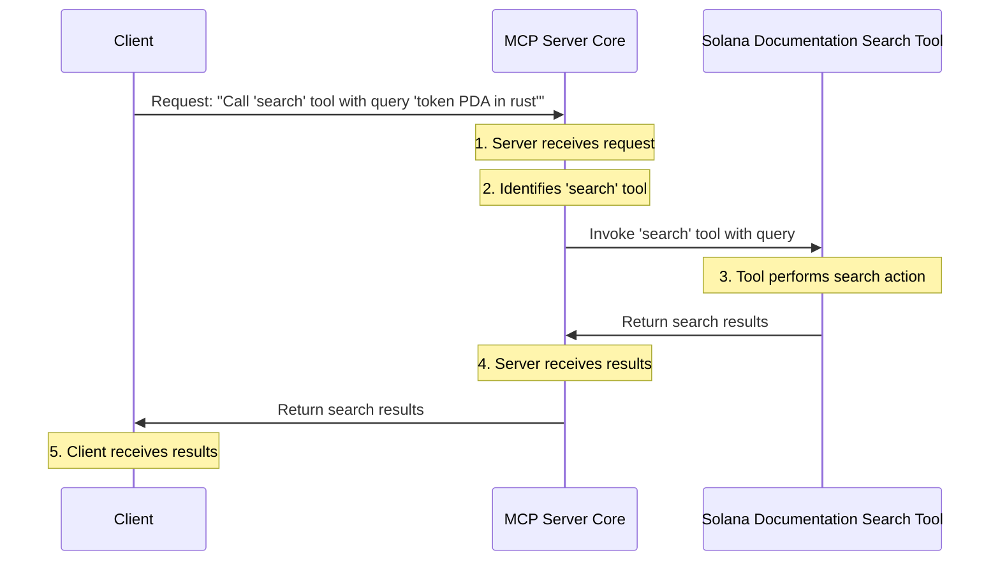

# Chapter 1: Model Context Protocol (MCP) Server Core

Imagine you're trying to build something cool with Solana, but you need to find specific information or perform a complex task. You might need to search documentation, interact with a smart contract, or even ask an AI for help. That's a lot of different "tools" and "resources" to juggle!

This is where the **Model Context Protocol (MCP) Server Core** comes in. Think of it as the ultimate "control center" or the "brain" for all things Solana development. Its main job is to make your life easier by acting as a central dispatcher. It connects you to various [Solana Tools (SolanaTool)](02_solana_tools__solanatool__.md) and [MCP Resources](05_mcp_resources_.md) without you needing to know the nitty-gritty details of each one.

## What Problem Does the MCP Server Core Solve?

Let's say you want to figure out "How do I derive a token PDA in Rust?". Without the MCP Server, you'd have to:

1.  Open a browser.
2.  Go to the Solana documentation.
3.  Type in your query.
4.  Read through results.
5.  Maybe open another tool for a different task.

The MCP Server Core solves this by being a single point of contact. You just tell the MCP Server what you want, and it figures out which tool or resource is best suited to help, uses it, and gives you the answer back. It's like having a super-smart assistant that knows how to use all your development tools for you!

## How Does the Brain Work?

The MCP Server Core has two main superpowers:

1.  **It knows all the tools**: Every [Solana Tool (SolanaTool)](02_solana_tools__solanatool__.md) (like a "Solana Documentation Search" or an "Anchor Framework Expert") registers itself with the MCP Server. When it registers, it tells the server: "Hey, my name is 'Solana Documentation Search'. If you give me a `query` (a search term), I can find relevant documents and give them back to you."
2.  **It dispatches requests**: When you ask the MCP Server a question (e.g., "How to derive a token PDA?"), it intelligently looks through all the tools it knows. It then picks the best tool for the job, sends your request to that tool, gets the result, and hands it back to you.

It's like a library with a super organized librarian. You tell the librarian what book you need, and they know exactly where to find it, even if it's in a special section or requires a unique way of getting it.

## Using the MCP Server Core

As a developer, you won't directly "build" the MCP Server Core every time. Instead, you'll primarily interact with it by sending requests. Imagine you have a special remote control for your "master builder" (the MCP Server Core).

Here's a simple example of how a client (your remote control) might ask the MCP Server Core to "search" for something:

```typescript
// This is from our test file, showing how a client talks to the MCP Server
import { Client } from "@modelcontextprotocol/sdk/client/index.js";

// ... (setup code for the client and server) ...

it("Search should return results as structured content", async () => {
    // We're asking the MCP Server Core to call a tool named "search"
    const result = await client.callTool(
        {
            name: "search", // The name of the tool we want to use
            arguments: {
                // The input (arguments) that the "search" tool needs
                query: "How do I derive a token pda in rust?",
            },
        },
        undefined,
        {}
    );

    // We expect to get back some structured content (the search results!)
    expect(result.structuredContent).toBeDefined();
    expect((result.structuredContent as any).results).toBeInstanceOf(Array);
    expect((result.structuredContent as any).results.length).toBeGreaterThan(0);
});
```

**Explanation:**

*   `client.callTool(...)`: This is how you tell the MCP Server Core, "Please use one of your registered tools!"
*   `name: "search"`: We are specifically asking to use the tool named "search". The MCP Server Core knows about this tool because it was registered earlier.
*   `arguments: { query: "..." }`: We provide the "search" tool with the input it needs: a `query` string.
*   `result.structuredContent`: After the "search" tool does its job, the MCP Server Core sends back the results to our client, which we can then use. In this case, it's an array of search results.

This small snippet shows how simple it is for a client to get complex work done by leveraging the MCP Server Core's ability to manage and orchestrate tools.

## Under the Hood: How the Server Core Works

Let's peek behind the scenes to see what happens when the MCP Server Core receives a request like our "search" example.

### Step-by-Step Walkthrough

1.  **Client makes a request**: You, as the developer (or an AI agent!), send a request to the MCP Server saying, "Please find documentation about 'token PDAs' using the 'search' tool."
2.  **Server receives request**: The MCP Server Core gets this request.
3.  **Identifies the tool**: The Server Core looks up the tool named "search" in its internal registry (the list of all tools it knows about).
4.  **Calls the tool**: It then activates the "search" tool, passing it your query ("How do I derive a token pda in rust?").
5.  **Tool performs action**: The "search" tool goes off, queries the Solana documentation, and gathers the relevant links and snippets.
6.  **Tool returns results**: The "search" tool sends its findings back to the MCP Server Core.
7.  **Server returns results to client**: Finally, the MCP Server Core takes those results and sends them back to you.

Here's a simple diagram to visualize this flow:



### The Code Behind the Brain

The MCP Server Core itself is built using the `@modelcontextprotocol/sdk` library. Let's look at `lib/index.ts` to see how it's created and how tools are registered.

```typescript
// File: lib/index.ts
import { McpServer } from "@modelcontextprotocol/sdk/server/mcp.js";
import { createMcpHandler } from "@vercel/mcp-adapter";
// ... other imports ...

export function createMcp() {
    return createMcpHandler(
        (server: McpServer) => {
            // This is where all our Solana-specific tools are registered!
            ([] as SolanaTool[])
                .concat(generalSolanaTools, geminiSolanaTools, solanaEcosystemTools, openAITools)
                .forEach((tool: SolanaTool) => {
                    if (tool.outputSchema) {
                        // Registering a tool with a specific input and output structure
                        server.registerTool(tool.title, {
                            description: tool.description ?? "",
                            inputSchema: tool.parameters, // What inputs the tool needs
                            outputSchema: tool.outputSchema, // What outputs the tool provides
                            annotations: {},
                        }, tool.func); // The actual function the tool runs
                    } else {
                        // A simpler way to register tools without explicit output schemas
                        server.tool(tool.title, tool.description ?? "", tool.parameters, tool.func);
                    }
                });

            // ... (resources and prompts are registered here too, covered in later chapters) ...
        },
        {
            capabilities: {},
        },
        {
            basePath: "",
            redisUrl: process.env.REDIS_URL,
            maxDuration: 60,
            verboseLogs: true,
        }
    )
}
```

**Explanation:**

*   `createMcpHandler`: This function, provided by `@vercel/mcp-adapter`, sets up the main server logic.
*   `(server: McpServer) => { ... }`: Inside this function, we get access to the `server` object, which is our MCP Server Core instance.
*   `server.registerTool(...)` or `server.tool(...)`: These are the crucial lines! This is where each individual [Solana Tool (SolanaTool)](02_solana_tools__solanatool__.md) announces itself to the MCP Server Core. It tells the server its `title` (name), `description`, `inputSchema` (what kind of information it needs to work), `outputSchema` (what kind of information it will return), and `func` (the actual code it runs).

By doing this, the MCP Server Core builds its internal knowledge base of all available tools and their capabilities. When a request comes in, it consults this registry to decide which tool to use.

## Conclusion

In this chapter, we learned that the **Model Context Protocol (MCP) Server Core** is the intelligent hub of the Solana Developer MCP. It acts like a "master builder," organizing and dispatching tasks to various [Solana Tools (SolanaTool)](02_solana_tools__solanatool__.md) and [MCP Resources](05_mcp_resources_.md). We saw how it registers the capabilities of each tool and then orchestrates their use when a request comes in, simplifying complex development tasks for clients.

Next, we'll dive deeper into these individual helpers and understand what exactly a "[Solana Tool (SolanaTool)](02_solana_tools__solanatool__.md)" is and how it functions.

[Chapter 2: Solana Tools (SolanaTool)](02_solana_tools__solanatool__.md)

<sub><sup>**References**: [[1]](https://github.com/solana-foundation/solana-mcp-official/blob/9f9b449ab96e0ba1ad0d0ad7b921c142af54bdf3/README.md), [[2]](https://github.com/solana-foundation/solana-mcp-official/blob/9f9b449ab96e0ba1ad0d0ad7b921c142af54bdf3/api/server.ts), [[3]](https://github.com/solana-foundation/solana-mcp-official/blob/9f9b449ab96e0ba1ad0d0ad7b921c142af54bdf3/lib/index.ts), [[4]](https://github.com/solana-foundation/solana-mcp-official/blob/9f9b449ab96e0ba1ad0d0ad7b921c142af54bdf3/package.json), [[5]](https://github.com/solana-foundation/solana-mcp-official/blob/9f9b449ab96e0ba1ad0d0ad7b921c142af54bdf3/tests/e2e.test.ts)</sup></sub>