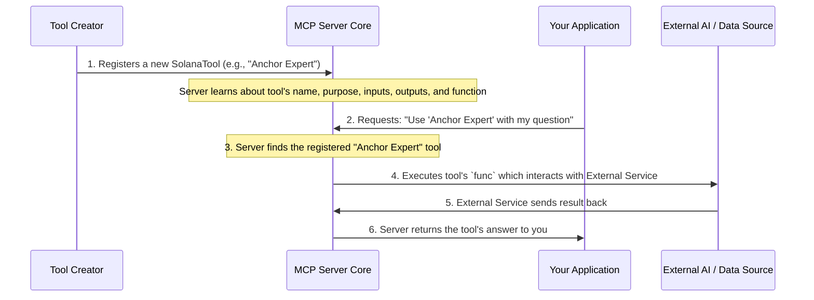

# Chapter 2: Solana Tools (SolanaTool)

In our last chapter, we imagined the [Model Context Protocol (MCP) Server Core](01_model_context_protocol__mcp__server_core_.md) as the "brain" or "control center" for all your Solana development tasks. It's super smart, but a brain still needs hands to do things, right? That's where **Solana Tools (SolanaTool)** come in!

Think of Solana Tools as the MCP Server Core's specialized hands or helpful assistants. Each one is designed to perform a very specific job related to Solana development. Instead of the "brain" having to figure out *how* to search documentation or *how* to answer a question about Anchor, it can just tell a dedicated "Solana Documentation Search" tool or an "Anchor Framework Expert" tool to do the job.

## What Problem Do Solana Tools Solve?

Imagine you're building a new Solana program and you have a few questions:

1.  "How do I create a Program Derived Address (PDA) in Rust?" (This needs general Solana knowledge).
2.  "What's the best way to handle errors in Anchor programs?" (This needs Anchor-specific knowledge).

Without Solana Tools, you might have to:

*   Open a browser for general Solana docs.
*   Open a different browser tab (or even a different internal documentation system) for Anchor docs.
*   Manually search each one.

This juggling can be tedious and slow. Solana Tools solve this by packaging these specific tasks into neat, understandable units. The [MCP Server Core](01_model_context_protocol__mcp__server_core_.md) knows about all these tools and can pick the right one for your request, making your life much simpler!

## What is a Solana Tool?

A `SolanaTool` is like a mini-app or a skilled specialist designed for one particular purpose. Each tool clearly defines:

*   **Its Name (`title`)**: How you refer to it (e.g., "Solana\_Documentation\_Search").
*   **Its Purpose (`description`)**: What it's good at.
*   **What It Needs (`parameters`)**: The inputs or arguments it accepts to do its job (like a search `query`).
*   **What It Gives Back (`outputSchema`)**: The format of the results it will provide.
*   **How It Works (`func`)**: The actual code that runs to perform the task, often by using powerful [AI Model Providers](03_ai_model_providers_.md) or tapping into data sources.

Here's a quick overview of these parts:

| Part Name      | Analogy                                   | What it means for a SolanaTool                               |
| :------------- | :---------------------------------------- | :----------------------------------------------------------- |
| `title`        | The app's name on your phone              | The unique name for the tool (e.g., "Anchor\_Expert").      |
| `description`  | The app's description in the app store    | A short sentence explaining what the tool does.              |
| `parameters`   | What you type into the app                | The input data the tool needs (e.g., a `question` or `query`). |
| `outputSchema` | The format of the results the app shows   | The expected structure of the information the tool returns.  |
| `func`         | The app's internal code that makes it work | The actual code that runs when the tool is called.           |

## Using Solana Tools (Through the MCP Server Core)

Remember from Chapter 1 that you don't directly talk to the tools. Instead, you send your request to the [MCP Server Core](01_model_context_protocol__mcp__server_core_.md), and *it* finds and uses the right tool for you.

Let's revisit our questions from earlier and see how we'd use Solana Tools to get answers:

### Example 1: Searching General Solana Documentation

Let's say you want to know: "How do I derive a token PDA in Rust?" This sounds like a job for a general Solana documentation search tool.

```typescript
// How a client might ask the MCP Server Core to search general Solana docs
import { Client } from "@modelcontextprotocol/sdk/client/index.js";

// ... (setup code for client) ...

// We're asking the MCP Server Core to call a tool named "Solana_Documentation_Search"
const result = await client.callTool(
    {
        name: "Solana_Documentation_Search", // The name of the tool
        arguments: {
            query: "How do I derive a token pda in rust?", // The search term
        },
    },
    undefined,
    {}
);

// After the tool runs, 'result.structuredContent' would contain the search results!
// For example, it might contain links and snippets from documentation.
console.log(result.structuredContent);
```

**What happens:** You tell the MCP Server Core you want to use the `Solana_Documentation_Search` tool and give it your `query`. The Server Core then activates that specific tool, which goes off, finds relevant documents, and brings the information back to you.

### Example 2: Asking the Anchor Framework Expert

Now, for our Anchor-specific question: "How do I create a new account in Anchor?" We have a special tool for that!

```typescript
// How a client might ask the MCP Server Core to use the Anchor Expert
import { Client } from "@modelcontextprotocol/sdk/client/index.js";

// ... (setup code for client) ...

// We're asking the MCP Server Core to call a tool named "Ask_Solana_Anchor_Framework_Expert"
const result = await client.callTool(
    {
        name: "Ask_Solana_Anchor_Framework_Expert", // The name of our expert tool
        arguments: {
            question: "How do I create a new account in Anchor?", // Our Anchor question
        },
    },
    undefined,
    {}
);

// The 'result.content' would then have the expert's answer!
// For example, it might contain a detailed explanation from the Anchor documentation.
console.log(result.content);
```

**What happens:** Similar to the search tool, you ask the MCP Server Core to use the `Ask_Solana_Anchor_Framework_Expert` tool with your specific `question`. The Server Core then executes the Anchor expert tool, which uses its specialized knowledge (often powered by an AI) to give you a precise answer.

## Under the Hood: How Solana Tools Are Made

Let's peek behind the curtain to see how these specialized assistants are defined and registered.

### Step-by-Step Walkthrough

1.  **Tool Definition**: A developer (like us!) creates a `SolanaTool` by defining its `title`, `description`, `parameters`, `outputSchema`, and most importantly, its `func` (the actual code it runs).
2.  **Tool Grouping**: These individual `SolanaTool` definitions are often organized into lists, like `generalSolanaTools` or `geminiSolanaTools`, to keep things tidy.
3.  **Registration with MCP Server Core**: When the [MCP Server Core](01_model_context_protocol__mcp__server_core_.md) starts up, it loops through all these lists and uses `server.registerTool()` to add each `SolanaTool` to its internal registry. This is how the "brain" learns about all its "hands."
4.  **Client Request**: When your application makes a `client.callTool()` request, the MCP Server Core looks up the tool by its `name`.
5.  **Execution**: The Server Core then executes the `func` associated with that tool, passing along your `arguments`.
6.  **Task Performance**: The tool's `func` does its work. For example, it might send your query to an external AI model or search a database.
7.  **Result Return**: The `func` returns its findings back to the MCP Server Core, which then sends them back to your application.

Here's a diagram to visualize this process:



### The Code Behind the Tool

Let's look at how a `SolanaTool` is defined in the project.

First, the basic structure of a `SolanaTool` is defined in `lib/tools/types.ts`:

```typescript
// File: lib/tools/types.ts
import { z } from "zod"; // 'zod' helps define the structure of data

export type SolanaTool = {
    title: string;
    description?: string;
    parameters: z.ZodRawShape; // Defines expected inputs
    outputSchema?: z.ZodRawShape; // Defines expected outputs
    func: (params: any) => Promise<any>; // The actual function to run
};
```

**Explanation:**
This code defines what a `SolanaTool` *is*. It's a blueprint saying every tool must have a `title`, an optional `description`, `parameters` (inputs), an optional `outputSchema` (outputs), and a `func` (the code that performs the task). The `z.ZodRawShape` is a fancy way to say "a description of data structure," ensuring that inputs and outputs are always in a predictable format.

Now, let's see an actual `SolanaTool` in action, like our "Anchor Framework Expert" from `lib/tools/geminiSolanaTools.ts`:

```typescript
// File: lib/tools/geminiSolanaTools.ts (simplified)
import { z } from "zod";
import { generateText } from "ai"; // Used to interact with AI models
import fs from "fs/promises";
import path from "path";
import { SolanaTool } from "./types";
import { openrouter } from ".."; // Our AI model provider

export const geminiSolanaTools: SolanaTool[] = [
  {
    title: "Ask_Solana_Anchor_Framework_Expert",
    description: "Ask questions about developing on Solana with the Anchor Framework.",
    parameters: {
      question: z.string().describe("Any question about the Anchor Framework."),
    },
    // No explicit outputSchema here, it defaults to a text string in this case.

    func: async ({ question }: { question: string }) => {
      // 1. Load Anchor documentation from a file
      const anchorDocsText = await fs.readFile(
        path.join(__dirname, "..", "context", "anchorDocs.xml"),
        "utf8"
      );

      // 2. Prepare a "system prompt" for the AI, giving it context
      const systemPrompt = `
      You are an expert software engineer specializing in the Anchor Framework.
      You will answer the user's question based on the provided Anchor documentation.
      Anchor Documentation: ${anchorDocsText}`;

      // 3. Ask an AI model (like Gemini) to answer the question using the docs
      const { text } = await generateText({
        system: systemPrompt,
        model: openrouter("google/gemini-2.0-flash-001"), // Using an AI model provider
        messages: [{ role: "user", content: question }],
      });

      // 4. Return the AI's answer
      return { content: [{ type: "text", text }] };
    },
  },
];
```

**Explanation:**
*   `export const geminiSolanaTools: SolanaTool[] = [...]`: This creates an array (a list) of `SolanaTool` definitions. This is where multiple tools can be grouped together.
*   `title` and `description`: Clearly define what this tool is.
*   `parameters`: It expects one input called `question`, which must be a string.
*   `func`: This is the heart of the tool.
    *   It first reads an `anchorDocs.xml` file, which contains a lot of Anchor documentation. This is like giving the "expert" its knowledge base.
    *   It then constructs a `systemPrompt` to tell the AI model (from `openrouter`) *how* to act and *what information* to use (the `anchorDocsText`).
    *   `generateText`: This is a function that sends the user's `question` (along with the `systemPrompt` and chosen `model`) to an actual AI service.
    *   Finally, it returns the `text` (the AI's answer) back to the MCP Server Core, which then sends it to the client.

This tool essentially turns an AI model into a specialized Anchor expert by feeding it specific documentation and giving it instructions. Other tools, like `Solana_Documentation_Search` (found in `lib/tools/generalSolanaTools.ts`), might work similarly, but with different AI models or documentation sources.

## Conclusion

In this chapter, we've explored **Solana Tools (SolanaTool)** – the specialized assistants that empower the [MCP Server Core](01_model_context_protocol__mcp__server_core_.md) to perform complex tasks. We learned that each tool defines its purpose, inputs, outputs, and the actual function that executes its task. We saw how these tools simplify tasks like searching documentation or getting expert advice, and we peeked into how they are defined and registered within the project.

These tools often rely on powerful AI models to do their work. Next, we'll dive into how these intelligent **AI Model Providers** integrate with our system.

[Chapter 3: AI Model Providers](03_ai_model_providers_.md)

---
<sub><sup>**References**: [[1]](https://github.com/solana-foundation/solana-mcp-official/blob/9f9b449ab96e0ba1ad0d0ad7b921c142af54bdf3/lib/tools/ecosystemSolanaTools.ts), [[2]](https://github.com/solana-foundation/solana-mcp-official/blob/9f9b449ab96e0ba1ad0d0ad7b921c142af54bdf3/lib/tools/geminiSolanaTools.ts), [[3]](https://github.com/solana-foundation/solana-mcp-official/blob/9f9b449ab96e0ba1ad0d0ad7b921c142af54bdf3/lib/tools/generalSolanaTools.ts), [[4]](https://github.com/solana-foundation/solana-mcp-official/blob/9f9b449ab96e0ba1ad0d0ad7b921c142af54bdf3/lib/tools/openAITools.ts), [[5]](https://github.com/solana-foundation/solana-mcp-official/blob/9f9b449ab96e0ba1ad0d0ad7b921c142af54bdf3/lib/tools/types.ts), [[6]](https://github.com/solana-foundation/solana-mcp-official/blob/9f9b449ab96e0ba1ad0d0ad7b921c142af54bdf3/tests/e2e.test.ts)</sup></sub>