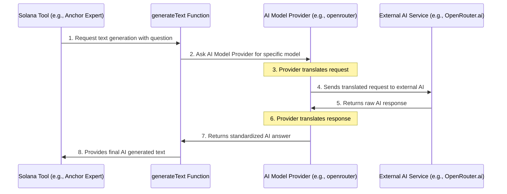

# Chapter 3: AI Model Providers

In [Chapter 2: Solana Tools (SolanaTool)](02_solana_tools__solanatool__.md), we learned that Solana Tools are like specialized assistants for the [MCP Server Core](01_model_context_protocol__mcp__server_core_.md). These tools can do amazing things, like answer complex questions about Anchor or search through tons of Solana documentation. But where do these "smarts" actually come from? How do they "know" the answers or how to search effectively?

Often, these powerful abilities come from **AI models** (like Large Language Models, or LLMs) that are provided by different companies. Imagine you have a brilliant brain (the AI model) that can generate text or understand complex queries. The problem is, there are many different AI models out there (from Google, OpenAI, etc.), and each one has its own specific way of being asked questions. It's like having many different types of light bulbs, but each needs a different kind of plug!

This is where **AI Model Providers** come in. They act like a **universal adapter** for all these different AI engines.

## What Problem Do AI Model Providers Solve?

Let's revisit our "Ask Solana Anchor Framework Expert" tool from the last chapter. When you asked it, "How do I create a new account in Anchor?", it didn't magically know the answer. It used an AI model to generate that response!

Without AI Model Providers, if you wanted your tool to use, say, Google's Gemini model *and* also a specialized search AI from Inkeep, you'd have to write separate, complicated code to talk to each one. This would mean:

*   Learning each AI service's unique API (Application Programming Interface).
*   Handling different ways of sending data.
*   Dealing with different ways of receiving responses.

It would be a headache! The **AI Model Providers** abstraction solves this by giving us a single, easy way to talk to any supported AI model, no matter who provides it. It makes integrating powerful AI into our [Solana Tools](02_solana_tools__solanatool__.md) super simple.

## What are AI Model Providers?

Think of AI Model Providers like a **universal remote control** for all your different smart devices. You press "play" on the universal remote, and it sends the correct signal to your TV, your soundbar, or whatever device you've set it up for.

In our project, the magic behind this universal adapter is the `createOpenAI` function from the `@ai-sdk/openai` library. Don't let the name "OpenAI" confuse you! While it can connect to OpenAI's models, it's designed to be flexible enough to connect to **many different AI services** that use a similar communication style. This includes services like:

*   **Inkeep**: A specialized service often used for RAG (Retrieval Augmented Generation) to search and answer questions based on specific documentation.
*   **OpenRouter**: A service that gives you access to many different AI models (like Google's Gemini, or various OpenAI models) through a single API.

Here's how these providers make connecting to different AI models easy:

| AI Model Provider's Job       | Analogy                                     | What it means for `solana-mcp-official`                            |
| :---------------------------- | :------------------------------------------ | :----------------------------------------------------------------- |
| **Standardize Requests**      | Turning your voice into a universal language | It ensures all `Solana Tools` ask for AI help in the same way.     |
| **Connect to Specific Service** | Knowing the unique "language" of each device | It translates that standard request into what a specific AI service (like Inkeep or OpenRouter) understands. |
| **Handle Responses**          | Translating the device's reply back to you   | It takes the AI service's answer and converts it into a standard format our tools can easily use. |

## How Solana Tools Use AI Model Providers

Let's look at a concrete example from our `SolanaTool` for asking the Anchor expert. In [Chapter 2](02_solana_tools__solanatool__.md), we saw this snippet:

```typescript
// From lib/tools/geminiSolanaTools.ts (simplified)
import { generateText } from "ai";
import { openrouter } from ".."; // Our AI model provider

// ... inside the func for Ask_Solana_Anchor_Framework_Expert
const { text } = await generateText({
  // ... other AI settings like systemPrompt ...
  model: openrouter("google/gemini-2.0-flash-001"), // <-- This is where the AI model provider is used!
  messages: [{ role: "user", content: question }],
});
// ...
```

**Explanation:**

*   `generateText`: This is a function (from the `ai` library) that acts as the main interface for talking to *any* AI model. You give it your `messages` (your question), and it handles sending them off.
*   `model: openrouter("google/gemini-2.0-flash-001")`: This is the crucial part! Instead of directly calling some complex Google Gemini API, we simply tell `generateText` which model we want to use.
    *   `openrouter(...)`: This is our custom **AI Model Provider** function (which we'll see how it's created soon!).
    *   `"google/gemini-2.0-flash-001"`: This is the specific AI model we want to use, provided through the OpenRouter service.

This line is telling the system: "Hey `generateText`! Please use the Gemini 2.0 Flash model, and reach it through our `openrouter` connection, to answer this `question`."

Similarly, for tools that use Inkeep for RAG-based searches, you'll see:

```typescript
// From lib/tools/generalSolanaTools.ts (simplified)
import { generateText } from "ai";
import { inkeep } from ".."; // Another AI model provider

// ... inside the func for Solana_Documentation_Search
const { text } = await generateText({
  model: inkeep("inkeep-rag"), // <-- Using the Inkeep AI model provider!
  messages: [{ role: "user", content: query }],
});
// ...
```

Here, the `inkeep("inkeep-rag")` tells `generateText` to use the specialized RAG model provided by Inkeep.

## Behind the Scenes: The "Universal Adapter" in Action

Let's trace what happens when a [Solana Tool](02_solana_tools__solanatool__.md) wants to use an AI model via an AI Model Provider.

### Step-by-Step Walkthrough

1.  **Tool Requests AI Help**: A [Solana Tool](02_solana_tools__solanatool__.md) (like the Anchor Expert) needs to generate an answer. It calls the `generateText` function.
2.  **Identifies Model Provider**: The tool tells `generateText` which specific `model` to use, for example, `openrouter("google/gemini-2.0-flash-001")`. This `openrouter` function is our AI Model Provider.
3.  **Provider Translates Request**: The `openrouter` (or `inkeep`) function takes the input (your question) and translates it into the exact format that the actual AI service (like OpenRouter.ai or Inkeep.com) expects. It also adds necessary things like API keys.
4.  **Sends to External AI Service**: The translated request is sent over the internet to the actual AI service.
5.  **External AI Processes**: The external AI service (e.g., OpenRouter running Google Gemini) processes the request and generates a response.
6.  **Provider Receives and Translates Response**: The AI Model Provider (our `openrouter` function) receives the raw response from the external AI service and translates it back into a standard format that `generateText` (and thus our `SolanaTool`) can easily understand.
7.  **Tool Gets Answer**: The `generateText` function returns the clean, usable answer to the [Solana Tool](02_solana_tools__solanatool__.md).

Here's a simple diagram to visualize this flow:



### The Code Behind the "Universal Adapter"

The actual setup of these AI Model Providers happens in `lib/index.ts`. This is where we configure `createOpenAI` to connect to our different services.

```typescript
// File: lib/index.ts (simplified)
import { createOpenAI } from "@ai-sdk/openai";

// Configure our Inkeep AI Model Provider
export const inkeep = createOpenAI({
    apiKey: process.env.INKEEP_API_KEY, // Your Inkeep API key from .env
    baseURL: "https://api.inkeep.com/v1", // The specific address for Inkeep
});

// Configure our OpenRouter AI Model Provider
export const openrouter = createOpenAI({
    apiKey: process.env.OPENROUTER_API_KEY, // Your OpenRouter API key from .env
    baseURL: "https://openrouter.ai/api/v1", // The specific address for OpenRouter
});

// ... rest of the createMcp function ...
```

**Explanation:**

*   `import { createOpenAI } from "@ai-sdk/openai";`: This line imports the core function that lets us create our AI Model Providers.
*   `export const inkeep = createOpenAI(...)`: We create an instance named `inkeep`.
    *   `apiKey: process.env.INKEEP_API_KEY`: This tells our provider to use an API key stored in an environment variable (like in your `.env` file). This key authenticates your requests with the Inkeep service.
    *   `baseURL: "https://api.inkeep.com/v1"`: This is the specific web address (URL) where the Inkeep AI service can be found.
*   `export const openrouter = createOpenAI(...)`: Similarly, we create an instance named `openrouter` with its own API key and base URL.

These `inkeep` and `openrouter` variables are now functions that, when called with a model name (like `inkeep("inkeep-rag")`), will return an object configured to talk to that specific AI service and model. This allows our `Solana Tools` to simply say "use Inkeep's RAG model" or "use OpenRouter's Gemini model" without worrying about the underlying API details.

This setup is very powerful because if we wanted to add support for another AI service, say, "MyCoolAIProvider," we would just add another `createOpenAI` call in `lib/index.ts` with its `apiKey` and `baseURL`, and then our tools could immediately start using it!

## Conclusion

In this chapter, we unpacked **AI Model Providers**, understanding them as the "universal adapters" that allow our project to effortlessly connect with various AI services like Inkeep and OpenRouter. We saw how `createOpenAI` from `@ai-sdk/openai` is used to abstract away API complexities, enabling [Solana Tools](02_solana_tools__solanatool__.md) to easily tap into powerful LLMs for generating text and performing RAG-based lookups. This crucial layer simplifies AI integration, making our system flexible and scalable.

Next, we'll explore how we feed these powerful AI models with specific knowledge to make them even smarter and more helpful: **Specialized Context Data**.

[Chapter 4: Specialized Context Data](04_specialized_context_data_.md)

---
 <sub><sup>**References**: [[1]](https://github.com/solana-foundation/solana-mcp-official/blob/9f9b449ab96e0ba1ad0d0ad7b921c142af54bdf3/.env.example), [[2]](https://github.com/solana-foundation/solana-mcp-official/blob/9f9b449ab96e0ba1ad0d0ad7b921c142af54bdf3/lib/index.ts), [[3]](https://github.com/solana-foundation/solana-mcp-official/blob/9f9b449ab96e0ba1ad0d0ad7b921c142af54bdf3/lib/tools/geminiSolanaTools.ts), [[4]](https://github.com/solana-foundation/solana-mcp-official/blob/9f9b449ab96e0ba1ad0d0ad7b921c142af54bdf3/lib/tools/generalSolanaTools.ts), [[5]](https://github.com/solana-foundation/solana-mcp-official/blob/9f9b449ab96e0ba1ad0d0ad7b921c142af54bdf3/lib/tools/openAITools.ts), [[6]](https://github.com/solana-foundation/solana-mcp-official/blob/9f9b449ab96e0ba1ad0d0ad7b921c142af54bdf3/package.json)</sup></sub>