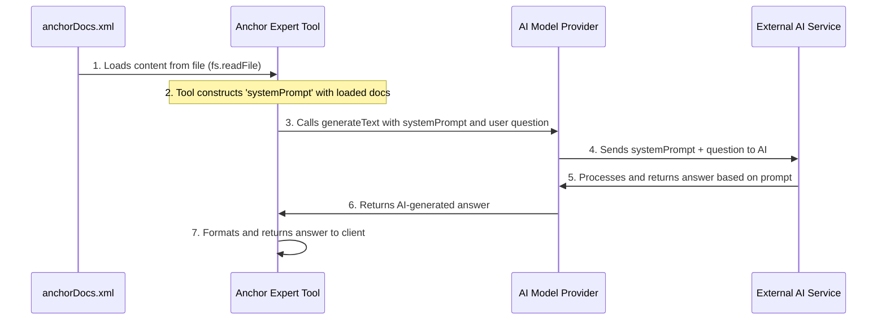

# Chapter 4: Specialized Context Data

In [Chapter 3: AI Model Providers](03_ai_model_providers_.md), we learned how to connect to powerful AI models through universal adapters. These AI models are incredibly smart, capable of understanding and generating text on a vast array of topics. But what if we want them to be *super specialists* in a very narrow field, like the Solana Anchor Framework? How do we give them deep, authoritative knowledge so they don't just give general answers, but truly expert ones?

This is where **Specialized Context Data** comes in. Imagine you're talking to a brilliant but general-purpose AI. If you ask, "How do I create a Program Derived Address (PDA) in Rust using Anchor?", the AI might give you a good general answer based on its vast training data. However, if the AI wasn't specifically trained on the *latest* Anchor documentation, its answer might be outdated, less precise, or miss critical nuances specific to Anchor's best practices.

Specialized Context Data solves this problem by giving our brilliant AI assistant a highly detailed, up-to-date **textbook** on a very specific subject. Instead of relying on its general knowledge for everything, we hand it the "Anchor Framework Handbook" and say, "Please use *this* book to answer questions about Anchor." This ensures the AI's responses are accurate, targeted, and grounded in authoritative content, making it a true domain expert.

Let's use our `Ask_Solana_Anchor_Framework_Expert` tool as a central example. To truly be an *expert*, it needs precise, deep knowledge. Specialized Context Data is *how* we provide that knowledge to the underlying AI model.

## What is Specialized Context Data?

Specialized Context Data refers to pre-loaded, domain-specific information that our "expert" [Solana Tools](02_solana_tools__solanatool__.md) use to provide highly accurate and targeted answers. It's essentially a dedicated knowledge base for a particular subject.

Here are its key characteristics:

| Characteristic         | Description                                                                                                                              | Example                                                 |
| :--------------------- | :--------------------------------------------------------------------------------------------------------------------------------------- | :-------------------------------------------------------- |
| **Pre-loaded**         | The data is prepared and available *before* the AI needs to answer a question, not searched on the fly.                                  | An `anchorDocs.xml` file stored locally in the project. |
| **Domain-specific**    | It focuses on a narrow subject area, providing depth rather than breadth.                                                                | Detailed documentation solely about the Anchor Framework. |
| **Authoritative**      | The content is considered reliable and accurate within its domain.                                                                       | Official Solana or Anchor documentation.                  |
| **Enhances AI Accuracy** | It guides the AI to generate responses based on provided facts, reducing reliance on potentially generalized or outdated training data. | AI answers about Anchor are precisely aligned with current best practices. |

In our `solana-mcp-official` project, this often takes the form of text files (like XML, Markdown, or plain text) containing documentation, code examples, or definitions relevant to Solana development.

## How Specialized Context Data is Used

Let's revisit our `Ask_Solana_Anchor_Framework_Expert` tool and see how it uses this specialized knowledge.

Remember the `func` (the core logic) from our Anchor Expert tool in [Chapter 2: Solana Tools (SolanaTool)](02_solana_tools__solanatool__.md)? It has a crucial step that involves loading and using this data:

```typescript
// From lib/tools/geminiSolanaTools.ts (simplified)
import fs from "fs/promises"; // For reading files
import path from "path";     // For handling file paths
import { generateText } from "ai"; // To interact with AI models
import { openrouter } from ".."; // Our AI model provider

export const geminiSolanaTools: SolanaTool[] = [
  {
    title: "Ask_Solana_Anchor_Framework_Expert",
    description: "Ask questions about developing on Solana with the Anchor Framework.",
    parameters: { /* ... */ },

    func: async ({ question }: { question: string }) => {
      // 1. Load Anchor documentation from a file
      const anchorDocsText = await fs.readFile(
        path.join(__dirname, "..", "context", "anchorDocs.xml"),
        "utf8"
      );

      // 2. Prepare a "system prompt" for the AI, giving it context
      const systemPrompt = `
      You are an expert software engineer specializing in the Anchor Framework.
      You will answer the user's question based on the provided Anchor documentation.
      Anchor Documentation: ${anchorDocsText}`; // <-- The loaded docs are injected here!

      // 3. Ask an AI model to answer the question using the docs
      const { text } = await generateText({
        system: systemPrompt, // <-- This is where the AI receives its "textbook"!
        model: openrouter("google/gemini-2.0-flash-001"),
        messages: [{ role: "user", content: question }],
      });

      // 4. Return the AI's answer
      return { content: [{ type: "text", text }] };
    },
  },
];
```

**Explanation of the `func`:**
1.  `anchorDocsText = await fs.readFile(...)`: This line *reads the specialized context data* from a file named `anchorDocs.xml`. This file contains a large amount of official Anchor Framework documentation.
2.  `systemPrompt = ...`: A `systemPrompt` is carefully created. This is a special instruction given to the AI model that tells it *how to behave* (e.g., "You are an expert") and *what information to use*. Notice how the `anchorDocsText` is directly inserted into this prompt. This is the key step: we are giving the AI its "textbook."
3.  `system: systemPrompt`: When `generateText` is called to interact with the AI model, this `systemPrompt` (containing all the Anchor documentation) is sent along with the user's `question`.

This means the AI doesn't just rely on its general "memory"; it actively "reads" and "processes" the provided `anchorDocsText` *in real-time* to formulate its answer, ensuring it's highly specific to Anchor.

## Under the Hood: How it Connects

Let's visualize how this specialized data flows from its source to the AI model, making the AI an expert.



**Step-by-step walkthrough:**

1.  **Docs File**: The specialized context data is stored in `anchorDocs.xml` within the `lib/context/` directory.
2.  **Solana Tool**: Our `Ask_Solana_Anchor_Framework_Expert` tool starts by reading the entire content of `anchorDocs.xml`.
3.  **Construct Prompt**: The tool then combines this loaded documentation with instructions for the AI (e.g., how to act), creating a comprehensive `systemPrompt`. This prompt essentially says, "Act as an Anchor expert, and here is all the detailed Anchor documentation you should use to answer."
4.  **AI Model Provider**: The tool then uses the `generateText` function, which in turn leverages an [AI Model Provider](03_ai_model_providers_.md) (like `openrouter`) to communicate with an external AI service. The crucial part is that the `systemPrompt` is passed along with the user's actual question.
5.  **External AI Service**: The AI model at the external service receives both the general instructions *and* the entire Anchor documentation. It then uses this provided "textbook" to understand the user's question and generate a highly relevant and accurate answer.
6.  **Answer Back**: The AI's answer travels back through the `AI Model Provider` to the `Solana Tool`, and finally to the client.

This process is a form of **Retrieval Augmented Generation (RAG)**, a common technique in AI to ground models in specific, up-to-date knowledge, preventing "hallucinations" and ensuring authoritative responses.

## The Specialized Context Data File (`anchorDocs.xml`)

Let's look at a small snippet of the `anchorDocs.xml` file, which is located in the `lib/context/` directory:

```xml
<!-- File: lib/context/anchorDocs.xml (simplified snippet) -->
<file_contents>
File: anchor/docs/content/docs/basics/cpi.mdx

````mdx
---
title: Cross Program Invocation
description:
  Learn how to implement Cross Program Invocations (CPIs) in Anchor programs to
  enable composability between different Solana programs.
---

Cross Program Invocations (CPI) refer to the process of one program invoking
instructions of another program, which enables the composibility of Solana
programs.
<!-- ... many more lines of Anchor documentation ... -->
````
</file_contents>
```

**Explanation of the content:**
This file isn't just any text; it's meticulously structured to contain actual markdown content from the Anchor documentation. By loading this, the AI has access to definitions, code examples, and explanations straight from the source. The `<file_contents>` and `mdx` tags here are part of how the documentation is organized, but for the AI, it's all just raw text to process and learn from.

The power of this approach is that we can easily update this `anchorDocs.xml` file (or any other context data file) with the latest documentation, ensuring our AI expert always has the most current and accurate information without needing to be re-trained or re-deployed extensively.

## Conclusion

In this chapter, we explored **Specialized Context Data** and understood how it transforms general AI models into domain-specific experts. We saw that by pre-loading authoritative documentation (like the `anchorDocs.xml` file) and injecting it into the AI's `systemPrompt`, our [Solana Tools](02_solana_tools__solanatool__.md) can provide highly accurate and targeted answers for complex tasks. This "textbook" approach is crucial for building reliable AI-powered assistants in specialized fields like Solana development.

Next, we'll shift our focus from "tools" to "resources" and discover what **MCP Resources** are and how they complement our system.

[Chapter 5: MCP Resources](05_mcp_resources_.md)

---
 <sub><sup>**References**: [[1]](https://github.com/solana-foundation/solana-mcp-official/blob/9f9b449ab96e0ba1ad0d0ad7b921c142af54bdf3/lib/context/anchorDocs.xml), [[2]](https://github.com/solana-foundation/solana-mcp-official/blob/9f9b449ab96e0ba1ad0d0ad7b921c142af54bdf3/lib/tools/geminiSolanaTools.ts)</sup></sub>