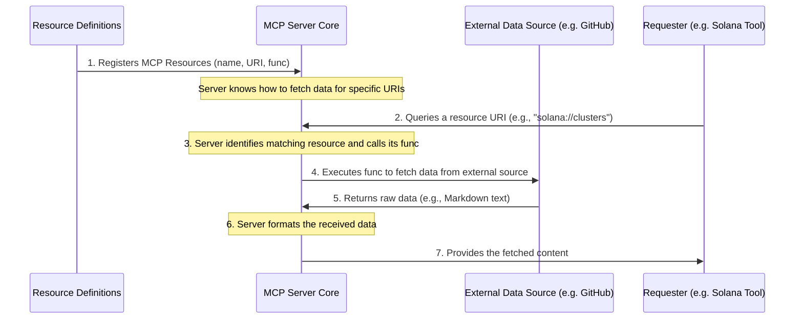

# Chapter 5: MCP Resources

In our last chapter, [Specialized Context Data](04_specialized_context_data_.md), we learned how to make our AI "experts" super smart by giving them pre-loaded, specific "textbooks" (like the `anchorDocs.xml` file). This is great for static, internal knowledge. But what if the information changes often, or is too vast to store locally, and we need the absolute latest version directly from its source?

Imagine you're building a Solana application, and you need to know the *current* list of available Solana clusters (like `mainnet-beta`, `devnet`, `testnet`). Or perhaps you need the *most up-to-date* installation instructions for the Solana CLI. You wouldn't want to rely on an old, saved document. You'd want to go straight to the official source, like Solana's GitHub documentation, and fetch the information live.

This is exactly the problem that **MCP Resources** solve. Think of them as **smart digital libraries** or a special "data tap" that the [MCP Server Core](01_model_context_protocol__mcp__server_core_.md) can use to access and provide structured data from various sources, especially external and dynamic ones. Instead of having local copies, an MCP Resource knows *how* to go out and get the information when it's needed, ensuring it's always fresh and accurate.

## What Are MCP Resources?

MCP Resources define specific, retrievable data sources that are integrated into the MCP framework. They are like special web addresses (called URIs, similar to URLs) that, when "visited," run some code to fetch information.

Here's how they differ from what we've seen before:

| Feature                   | [Solana Tools](02_solana_tools__solanatool__.md)                                                                   | [Specialized Context Data](04_specialized_context_data_.md)                                                    | **MCP Resources**                                                                                                   |
| :------------------------ | :----------------------------------------------------------------------------------------------------------------- | :--------------------------------------------------------------------------------------------------------------- | :------------------------------------------------------------------------------------------------------------------ |
| **Purpose**               | Perform actions, answer questions (often using AI).                                                                | Provide static, pre-loaded knowledge for AI tools.                                                               | Provide direct access to structured, potentially dynamic data sources.                                               |
| **Nature of Data**        | Processes data, generates new information.                                                                         | Static files (`.xml`, `.mdx`) stored locally.                                                                    | Dynamic content fetched on demand (e.g., from a website, GitHub).                                                   |
| **Access Method**         | Called with `client.callTool()` and specific `arguments`.                                                          | Injected into AI `systemPrompt` from local files.                                                                | Accessed by querying a specific URI (like `solana://clusters`), returning raw content.                              |
| **Example**               | "Ask Solana Anchor Framework Expert" tool.                                                                         | `anchorDocs.xml` file.                                                                                           | `solana://clusters` (fetches live cluster info from GitHub).                                                        |
| **Analogy**               | A chef who cooks meals.                                                                                            | Ingredients pre-stocked in the chef's fridge.                                                                    | An online grocery store the chef can order *fresh* ingredients from.                                                |

Essentially, an MCP Resource tells the server: "If someone asks for `solana://clusters`, here's the code to go grab the latest cluster information from the internet and give it back to them."

## How to Use MCP Resources

As a developer, you wouldn't directly "call" an MCP Resource in the same way you call a [Solana Tool](02_solana_tools__solanatool__.md). Instead, the [MCP Server Core](01_model_context_protocol__mcp__server_core_.md) makes these resources available, allowing internal tools or other components to `read` information from them using their unique **URI** (Uniform Resource Identifier).

Imagine a scenario where a [Solana Tool](02_solana_tools__solanatool__.md) wants to provide an answer about Solana clusters. It could internally "query" the `solana://clusters` resource to get the latest data.

Here’s how the MCP Server makes resources available:

1.  **URI**: Each resource has a unique URI pattern (e.g., `solana://clusters`, `solana://installation`). This acts like its address.
2.  **Function**: Each resource is backed by a function that knows how to fetch the actual data from an external source (like GitHub or a remote API).
3.  **Content**: When the resource's URI is queried, its function runs, fetches the data, and returns it as structured content.

For example, to get the latest Solana cluster information, a tool (or the MCP Server itself) might conceptually "read" from the `solana://clusters` resource. The MCP Server would then execute the resource's internal logic, which goes to GitHub, fetches the `clusters.mdx` file, and provides its content back.

This content can then be used by other parts of the MCP system, perhaps as additional context for an AI model or as direct information to return to a user.

## Under the Hood: How MCP Resources Work

Let's see how these dynamic data taps are set up and how they fetch information.

### Step-by-Step Walkthrough

1.  **Resource Definition**: We first define an MCP Resource by giving it a `name`, a `template` (its URI pattern), and a `func` (the code that fetches the actual data). These definitions are grouped in a file like `lib/resources.ts`.
2.  **Server Registration**: When the [MCP Server Core](01_model_context_protocol__mcp__server_core_.md) starts up (in `lib/index.ts`), it reads all these resource definitions and uses `server.resource()` to register each one. This tells the server: "I know how to get data for `solana://clusters`."
3.  **Resource Query**: At some point, the MCP Server (perhaps on behalf of a [Solana Tool](02_solana_tools__solanatool__.md) or another component) receives a request to `read` information from a specific resource URI (e.g., `solana://clusters`).
4.  **Execute Resource Function**: The server finds the registered resource matching the URI and calls its associated `func`.
5.  **Fetch External Data**: Inside the `func`, code is executed to go out and fetch the content from an external source, like making an HTTP request to GitHub.
6.  **Return Content**: The fetched content (e.g., the raw text of a Markdown file) is then wrapped in a standardized format and returned by the `func` to the MCP Server.
7.  **Server Provides Content**: The MCP Server then makes this content available to whoever queried the resource.

Here's a diagram to visualize this flow:



### The Code Behind the Resource

Let's look at the actual code that defines and registers these resources.

First, the definitions are in `lib/resources.ts`:

```typescript
// File: lib/resources.ts (simplified for one resource)
import { ResourceTemplate } from "@modelcontextprotocol/sdk/server/mcp.js";

export const resources = [
  {
    name: "solanaDocsClusters", // A unique name for this resource
    template: new ResourceTemplate("solana://clusters", { // Its URI pattern
      list: undefined, // Simpler template, no variable parts
    }),
    func: async (uri: any) => { // The function that fetches the data
      try {
        // 1. Fetch content from a specific URL on GitHub
        const response = await fetch(
          "https://raw.githubusercontent.com/solana-foundation/solana-com/main/content/docs/references/clusters.mdx"
        );
        const fileContent = await response.text(); // Get the raw text

        // 2. Return the content in a structured format
        return {
          contents: [
            {
              uri: uri.href, // The URI that was requested
              text: fileContent, // The actual content fetched
            },
          ],
        };
      } catch (error) {
        // Handle any errors during fetching
        return {
          contents: [
            {
              uri: uri.href,
              text: `Error: ${(error as Error).message}`,
            },
          ],
        };
      }
    },
  },
  // ... other resources like solanaDocsInstallation would follow a similar structure ...
];
```

**Explanation:**
*   `export const resources = [...]`: This is an array that holds definitions for all our MCP Resources.
*   `name: "solanaDocsClusters"`: This is a friendly internal name for the resource.
*   `template: new ResourceTemplate("solana://clusters", ...)`: This defines the unique address for this resource. When the server sees a request for `solana://clusters`, it knows to use *this* resource.
*   `func: async (uri: any) => { ... }`: This is the core logic.
    *   It uses `fetch` to make a web request to a specific GitHub URL, retrieving the `clusters.mdx` file, which contains information about Solana clusters.
    *   It then takes the raw text (`fileContent`) and returns it in a structured object, along with the `uri` it was requested for. This standardized output allows other parts of the MCP system to easily consume the data.

Next, let's see how these resources are registered with the [MCP Server Core](01_model_context_protocol__mcp__server_core_.md) in `lib/index.ts`:

```typescript
// File: lib/index.ts (simplified)
import { McpServer } from "@modelcontextprotocol/sdk/server/mcp.js";
import { createMcpHandler } from "@vercel/mcp-adapter";
import { resources } from "./resources"; // Import our resource definitions
// ... other imports and code ...

export function createMcp() {
    return createMcpHandler(
        (server: McpServer) => {
            // ... (Solana Tools registration from Chapter 1 and 2) ...

            // This is where MCP Resources are registered!
            resources.forEach((resource) => {
                server.resource(resource.name, resource.template, resource.func);
            });

            // ... (prompts registration from a later chapter) ...
        },
        {
            capabilities: {},
        },
        {
            basePath: "",
            redisUrl: process.env.REDIS_URL,
            maxDuration: 60,
            verboseLogs: true,
        }
    )
}
```

**Explanation:**
*   `import { resources } from "./resources";`: We bring in the list of resource definitions we created earlier.
*   `resources.forEach((resource) => { server.resource(resource.name, resource.template, resource.func); });`: This loop is the key! For each resource in our `resources` array, we call `server.resource()`. This method tells the `McpServer` instance about the resource's `name`, its `template` (the URI it responds to), and the `func` it should run to get data.

By doing this, the [MCP Server Core](01_model_context_protocol__mcp__server_core_.md) becomes aware of these data sources and can act as a gateway to retrieve live, external information when needed by other parts of the system.

## Conclusion

In this chapter, we explored **MCP Resources** as the mechanism for the [MCP Server Core](01_model_context_protocol__mcp__server_core_.md) to access and provide structured, potentially dynamic data from external sources. We learned that unlike [Specialized Context Data](04_specialized_context_data_.md), which is pre-loaded and static, MCP Resources fetch information on demand using a URI-based system, ensuring the data is always up-to-date. We saw how these resources are defined with a specific function to retrieve data (e.g., from GitHub) and then registered with the server to make them retrievable.

Next, we'll shift our focus to understanding how the MCP system keeps track of what's happening and provides insights into its operations: **Analytics and Logging**.

[Chapter 6: Analytics and Logging](06_analytics_and_logging_.md)

---
 <sub><sup>**References**: [[1]](https://github.com/solana-foundation/solana-mcp-official/blob/9f9b449ab96e0ba1ad0d0ad7b921c142af54bdf3/lib/index.ts), [[2]](https://github.com/solana-foundation/solana-mcp-official/blob/9f9b449ab96e0ba1ad0d0ad7b921c142af54bdf3/lib/resources.ts)</sup></sub>