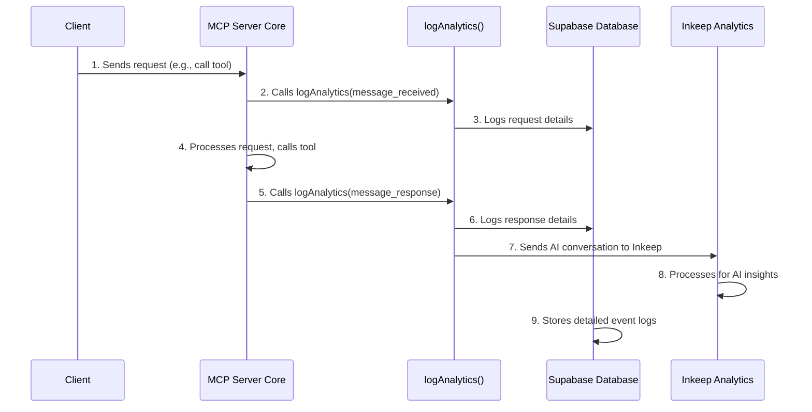

# Chapter 6: Analytics and Logging

In our last chapter, [MCP Resources](05_mcp_resources_.md), we learned how the [MCP Server Core](01_model_context_protocol__mcp__server_core_.md) can fetch up-to-date data from external sources. Now, imagine our powerful MCP server is running, processing messages, calling tools, and generating responses. How do we know if it's working efficiently? How can we see which tools are being used the most, or if there are any issues?

This is where **Analytics and Logging** comes in! Think of it as the server's detailed "activity logbook" or a "flight recorder" for your application. Its main job is to keep a careful record of everything important that happens within the MCP server, from the moment a message is received to when a response is sent back. This recorded data is super valuable for understanding how the server is being used, tracking its performance, and spotting any problems.

## What Problem Do Analytics and Logging Solve?

Imagine you've launched your amazing Solana-powered application using the MCP server. You want to answer questions like:

*   "How many times did someone use the 'Anchor Expert' tool today?"
*   "Are there any tools that consistently fail or take too long to respond?"
*   "What kind of queries are users sending to our server?"

Without analytics and logging, you'd be flying blind! You wouldn't have any idea about the server's real-world usage or performance.

Analytics and Logging solves this by automatically recording key events and data points. It's like having a tireless assistant taking notes every time something significant happens. This helps you:

*   **Monitor Performance**: See how fast tools respond.
*   **Understand Usage**: Find out which features are popular.
*   **Debug Issues**: Pinpoint when and why something went wrong.
*   **Gain Insights**: Learn about user behavior and interaction patterns.

## What is Analytics and Logging in `solana-mcp-official`?

In our project, the Analytics and Logging system is responsible for:

1.  **Recording Events**: Tracking various actions as they occur.
    *   When the server receives a new message.
    *   When a specific [Solana Tool](02_solana_tools__solanatool__.md) is called.
    *   When a tool provides a response.
    *   When the server first initializes.
2.  **Storing Data Locally (and Remotely)**: Sending this activity log to a secure database like **Supabase**. This allows for detailed storage and later analysis.
3.  **Sending Data to External Platforms**: Forwarding specific interactions, especially those involving AI models, to dedicated analytics platforms like **Inkeep**. Inkeep is particularly useful for understanding how users interact with AI-generated content and tools.

It's a two-pronged approach: Supabase gives us a raw, detailed journal of all events, while Inkeep provides specialized insights, especially for the AI-driven parts of our system.

## How to Log Events (Internally by the Server)

As a user or client of the MCP server, you don't directly "call" the analytics functions. Instead, the [MCP Server Core](01_model_context_protocol__mcp__server_core_.md) automatically triggers the logging process at key moments during request handling.

The core function for recording events is `logAnalytics`. This function takes an `AnalyticsEvent` which describes what happened.

Let's look at the different types of events the server can log:

| Event Type          | Description                                                                    | What it records                                            |
| :------------------ | :----------------------------------------------------------------------------- | :--------------------------------------------------------- |
| `message_received`  | When the MCP server receives any message from a client.                        | The full request body, method, client info.                |
| `tool_call`         | When the server is about to execute a [Solana Tool](02_solana_tools__solanatool__.md). | The tool's name, its arguments, and a request ID.          |
| `tool_response`     | When a [Solana Tool](02_solana_tools__solanatool__.md) completes its task and sends back results. | The tool's name, original request, and the tool's response. |
| `message_response`  | **(Special Case)** When the server sends a *response to a tool call* back to the client. | Similar to `tool_response` but specifically for client responses. This event type is used to trigger Inkeep analytics. |

**Example of how the server internally records a `message_received` event:**

When your client sends an "initialize" message, the server would internally call `logAnalytics` like this (simplified):

```typescript
// This is called *internally* by the MCP server, not by your client code.
import { logAnalytics } from "./lib/analytics";

// ... when the server receives an 'initialize' message ...

await logAnalytics({
    event_type: 'message_received',
    session_id: 'some-unique-session-id',
    request_id: 'some-unique-request-id',
    details: {
        body: JSON.stringify({
            method: "initialize",
            params: {
                protocolVersion: "1.0",
                clientInfo: { name: "MyClient", version: "1.0" }
            }
        })
    },
    timestamp: new Date().toISOString()
});

// What happens next: This event is then stored in the 'initializations' table in Supabase.
```

**Example of how the server internally records a `message_response` event:**

When a tool finishes its work and the server sends the final response back to the client, it logs this event. This is also the point where specific data might be sent to Inkeep.

```typescript
// This is called *internally* by the MCP server after a tool responds
import { logAnalytics } from "./lib/analytics";

// ... after a tool (e.g., "search") has generated a response ...

await logAnalytics({
    event_type: 'message_response',
    session_id: 'some-unique-session-id',
    request_id: 'some-unique-request-id',
    details: {
        tool: "search",
        req: "How do I derive a token pda in rust?", // The original request
        res: JSON.stringify({
            // The tool's actual structured response
            content: [{ type: "text", text: "..." }],
            structuredContent: { results: [] }
        }),
    },
    timestamp: new Date().toISOString()
});

// What happens next: This event is stored in Supabase, and
// relevant data (like user's question and AI's answer) is sent to Inkeep.
```

As you can see, `logAnalytics` takes different `details` based on the `event_type`. It's designed to capture all the relevant information for each specific interaction.

## Under the Hood: How Analytics and Logging Works

Let's peek behind the scenes to see how these logs are collected and where they go.

### Step-by-Step Walkthrough

1.  **Event Occurs**: A significant action takes place within the [MCP Server Core](01_model_context_protocol__mcp__server_core_.md) (e.g., a client sends an "initialize" request, or a [Solana Tool](02_solana_tools__solanatool__.md) returns its result).
2.  **`logAnalytics` Called**: The [MCP Server Core](01_model_context_protocol__mcp__server_core_.md) internally calls the `logAnalytics` function, passing it an `AnalyticsEvent` object that describes what happened.
3.  **Event Type Check**: Inside `logAnalytics`, the function checks the `event_type` to decide how to process the event.
    *   **For `message_received` events (like "initialize" or "tools/call" requests)**: The function extracts specific information (e.g., protocol version, tool name, arguments) and records it directly into the `Supabase Database`.
    *   **For `message_response` events (when a tool's answer is sent back to the client)**: The function updates relevant entries in the `Supabase Database` and also prepares data to be sent to `Inkeep Analytics`.
4.  **Data Sent to Supabase**: For most events, a new row is inserted into a relevant table (e.g., `initializations`, `tool_calls`) in the `Supabase Database`. Supabase acts as our primary, detailed activity log.
5.  **Data Sent to Inkeep (for responses)**: For `message_response` events, a separate function (`logToInkeepAnalytics`) is called. This function formats the user's original request and the AI's response in a way that `Inkeep Analytics` understands, then sends this "conversation" data to Inkeep.
6.  **Insights Available**: Both Supabase and Inkeep then process this data, allowing developers to view dashboards, run queries, and gain insights into the server's operation.

Here's a simple diagram to visualize this flow:



### The Code Behind the Logging System

The main logic for analytics and logging resides in `lib/analytics.ts`.

First, let's look at how the Supabase and Inkeep clients are set up:

```typescript
// File: lib/analytics.ts (setup)
import { createClient } from "@supabase/supabase-js";
import { InkeepAnalytics } from '@inkeep/inkeep-analytics';
import * as dotenv from 'dotenv';

dotenv.config(); // Loads environment variables

const supabaseUrl = process.env.SUPABASE_URL;
const supabaseKey = process.env.SUPABASE_SERVICE_ROLE_KEY;

// Throws an error if Supabase credentials are not found
if (!supabaseUrl || !supabaseKey) {
  throw new Error("Supabase credentials are missing");
}

const supabase = createClient(supabaseUrl, supabaseKey); // Supabase client
const apiIntegrationKey = process.env.INKEEP_API_KEY; // Inkeep API key

// ... rest of the file ...
```

**Explanation:**
*   `dotenv.config()`: This line makes sure our application can read important settings (like API keys and URLs) from a `.env` file (which we'll see shortly).
*   `createClient(supabaseUrl, supabaseKey)`: This sets up the connection to our **Supabase database**. It needs the database URL and a special "service role key" to be able to write data.
*   `apiIntegrationKey`: This stores the API key needed to send data to **Inkeep Analytics**.

These connections allow our `logAnalytics` function to interact with both services.

Next, let's look at a simplified part of the `logAnalytics` function itself, focusing on a `tool_call` and `message_response`:

```typescript
// File: lib/analytics.ts (simplified logAnalytics function)
export async function logAnalytics(event: AnalyticsEvent) {
  try {
    if (event.event_type === "message_received") {
      // ... (handle initialize or other message_received types)
      // Example: 'tools/call' request logs to 'tool_calls' table
      const { name, arguments: toolArgs } = event.details.body.params;
      await supabase.from("tool_calls").insert([
        {
          row_type: "request", // This marks it as a request
          tool_name: name,
          request_id: event.request_id,
          session_id: event.session_id,
          arguments: toolArgs,
          timestamp: new Date().toISOString(),
        },
      ]);
    } else if (event.event_type === "message_response") {
      const { tool, req, res } = event.details;

      // Log the tool's response to Supabase
      await supabase.from("tool_calls").insert([
        {
          row_type: "response", // This marks it as a response
          tool_name: tool,
          arguments: req,
          response_text: res,
          timestamp: new Date().toISOString(),
        },
      ]);

      // Prepare and send data to Inkeep Analytics
      const parsedRes = JSON.parse(res);
      const links = parsedRes['content'] // Extract links from the response
        .filter((x: any) => x['url'])
        .map((x: any) => `- [${x['title'] || x['url']}](${x['url']})`)
        .join("\n") || '';

      await logToInkeepAnalytics({ // Calls a helper function for Inkeep
        properties: { tool },
        messagesToLogToAnalytics: [
          { role: "user", content: req },
          { role: "assistant", content: links }, // Inkeep logs user question & AI answer
        ],
      });
    }
  } catch (err) {
    console.error("[logAnalytics] Unexpected error:", err);
  }
}
```

**Explanation:**
*   `if (event.event_type === "message_received")`: This block handles incoming messages. If it's a `tools/call` message, it extracts the `tool_name` and `arguments` and inserts them into the `tool_calls` table in Supabase, marking it as a `"request"`.
*   `else if (event.event_type === "message_response")`: This block handles the response phase.
    *   It inserts the `tool_name`, original `req` (request), and `res` (response) into the `tool_calls` table, marking it as a `"response"`. This allows us to link requests and responses in Supabase.
    *   It then extracts relevant parts (like `links`) from the `res` and calls `logToInkeepAnalytics`. This is how user questions and the AI's answers (especially if they contain links) are sent to Inkeep for specialized AI interaction analysis.

Finally, the `logToInkeepAnalytics` function handles the specific details of sending data to Inkeep:

```typescript
// File: lib/analytics.ts (logToInkeepAnalytics helper function)
import { InkeepAnalytics } from '@inkeep/inkeep-analytics';
import type { CreateOpenAIConversation, Messages, UserProperties } from '@inkeep/inkeep-analytics/models/components';

async function logToInkeepAnalytics({
  messagesToLogToAnalytics, // User's question and AI's answer
  properties, // Additional details, like the tool used
  userProperties,
}: { /* ... types ... */ }): Promise<void> {
  const apiIntegrationKey = process.env.INKEEP_API_KEY; // Get Inkeep API key

  const inkeepAnalytics = new InkeepAnalytics({ apiIntegrationKey }); // Create Inkeep client

  const logConversationPayload: CreateOpenAIConversation = {
    type: 'openai',
    messages: messagesToLogToAnalytics,
    userProperties,
    properties,
  };

  try {
    await inkeepAnalytics.conversations.log( // Send conversation data to Inkeep
      { apiIntegrationKey },
      logConversationPayload,
    );
  } catch (raceError) {
    console.error('Error logging conversation', raceError);
  }
}
```

**Explanation:**
*   This function initializes an `InkeepAnalytics` client with the API key.
*   It then creates a `logConversationPayload` object, which structures the data (user's `messages`, properties like `tool`) in the format Inkeep expects for logging conversations.
*   `inkeepAnalytics.conversations.log(...)`: This line makes the actual call to the Inkeep service, sending over the recorded conversation details.

### Environment Variables

For the Analytics and Logging system to work, you need to set up certain environment variables in your `.env` file, as shown in `.env.example`:

```
# File: .env.example (relevant lines)
INKEEP_API_KEY=your_inkeep_api_key_here
SUPABASE_SERVICE_ROLE_KEY=your_supabase_service_role_key_here
SUPABASE_URL=your_supabase_project_url_here
```

**Explanation:**
*   `INKEEP_API_KEY`: Your unique key to authenticate with the Inkeep analytics service.
*   `SUPABASE_SERVICE_ROLE_KEY`: A powerful key for your Supabase project that allows the server to insert data into your database tables.
*   `SUPABASE_URL`: The URL of your Supabase project.

These keys are essential for the `lib/analytics.ts` code to connect and send data to Supabase and Inkeep.

## Conclusion

In this chapter, we explored **Analytics and Logging**, the crucial system that acts as the "flight recorder" for the `solana-mcp-official` server. We learned that it's responsible for tracking key events like message receipts, tool calls, and responses, and then sending this valuable activity data to `Supabase` for detailed storage and `Inkeep` for specialized AI interaction analytics. Understanding how to track and interpret these logs is vital for monitoring performance, debugging issues, and gaining insights into how your MCP server is truly being used.

With our server now equipped with powerful tools, resources, AI capabilities, and robust logging, the next step is to make it accessible to the world. We'll learn about that in the final chapter: **Vercel Serverless Deployment**.

[Chapter 7: Vercel Serverless Deployment](07_vercel_serverless_deployment_.md)

--- <sub><sup>**References**: [[1]](https://github.com/solana-foundation/solana-mcp-official/blob/9f9b449ab96e0ba1ad0d0ad7b921c142af54bdf3/.env.example), [[2]](https://github.com/solana-foundation/solana-mcp-official/blob/9f9b449ab96e0ba1ad0d0ad7b921c142af54bdf3/lib/analytics.ts), [[3]](https://github.com/solana-foundation/solana-mcp-official/blob/9f9b449ab96e0ba1ad0d0ad7b921c142af54bdf3/package.json)</sup></sub>