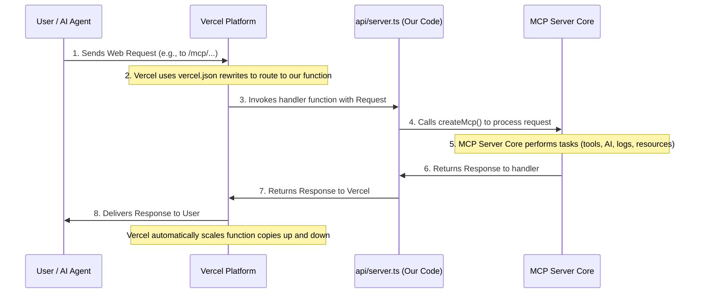

# Chapter 7: Vercel Serverless Deployment

In our last chapter, [Analytics and Logging](06_analytics_and_logging_.md), we learned how our powerful [Model Context Protocol (MCP) Server Core](01_model_context_protocol__mcp__server_core_.md) keeps detailed logs of all its activities. We now have a robust system that can call specialized [Solana Tools (SolanaTool)](02_solana_tools__solanatool__.md), connect to [AI Model Providers](03_ai_model_providers_.md), leverage [Specialized Context Data](04_specialized_context_data_.md), access [MCP Resources](05_mcp_resources_.md), and log everything important. That's a lot of clever engineering!

But here's the big question: How do we actually make this amazing server available to *everyone* over the internet? How do we ensure it can handle thousands of users asking questions at the same time without crashing, and without costing a fortune to run all day, every day?

This is where **Vercel Serverless Deployment** comes in! Think of it as the ultimate "automatic host" for our application. It takes our server's code, puts it on the internet, and makes sure it's always ready to respond to requests, no matter how many people are using it, all while being incredibly efficient with costs.

## What Problem Does Vercel Serverless Deployment Solve?

Imagine you've built a super-fast car, but it's sitting in your garage. No one can use it! To make it useful, you need to get it onto the road. Similarly, our MCP server code needs a place to "live" on the internet.

Without Vercel Serverless Deployment, we'd have to:

1.  **Rent a physical server:** Pay for a computer that runs 24/7, even when no one is using our app.
2.  **Manage that server:** Install software, keep it updated, fix issues, and deal with security.
3.  **Worry about traffic spikes:** If suddenly a lot of users show up, our single server might get overwhelmed and crash. We'd have to manually add more servers, which is complicated.

Vercel Serverless Deployment solves all these headaches by packaging our entire Solana Developer MCP application and making it available as a **serverless function**. This means:

*   **No Servers to Manage:** Vercel handles all the underlying computers, updates, and security. We just provide our code.
*   **Automatic Scaling:** If 1 user or 1,000 users access our server, Vercel automatically creates more "copies" of our function to handle the load, then scales back down when traffic decreases.
*   **Cost-Efficient:** We only pay when our code is actually running and responding to requests, not when it's idle. It's like paying for electricity only when you flip the light switch!

Our central use case is making the official Solana MCP Server available globally at `https://mcp.solana.com`. Vercel makes this possible and highly reliable.

## Key Concepts of Vercel Serverless Deployment

Let's break down the core ideas that allow Vercel to host our MCP server.

### 1. Serverless Functions

A "serverless function" is a small piece of code that runs only when it's needed, usually in response to an event like a web request. Instead of managing entire servers, you just write your function, and the cloud provider (like Vercel) manages everything else.

*   **You write the code:** Our MCP server's main logic is contained in a function.
*   **Vercel runs it:** When a user visits `mcp.solana.com/mcp`, Vercel quickly starts a "copy" of our function, gives it the user's request, and lets it do its work.
*   **It shuts down:** Once the function finishes its job and sends a response, it "shuts down," waiting for the next request.

### 2. The `vercel.json` Configuration File

`vercel.json` is a special file at the root of our project that tells Vercel *how* to deploy and run our application. It's like an instruction manual for Vercel.

In `solana-mcp-official`, this file configures two main things:

*   **Routing Rules (`rewrites`)**: How incoming web requests (like someone typing `mcp.solana.com/anything` into their browser) should be directed to our serverless function.
*   **Function Specifications (`functions`)**: Details about our serverless function itself, such as its entry point (where its code starts) and performance parameters.

### 3. Entry Point (`api/server.ts`)

For Vercel to run our serverless function, it needs to know *which* file contains the main code to execute. In our project, this is the `api/server.ts` file. This file acts as the "door" through which all incoming requests enter our MCP application.

### 4. Performance Parameters (`maxDuration`)

Some tasks, especially those involving complex AI model interactions or fetching large amounts of data, can take a bit longer. `maxDuration` is a setting that tells Vercel how long our serverless function is allowed to run before it's stopped. This is crucial for our MCP server, which can sometimes have longer-running AI operations. Setting it higher means our tools have enough time to complete their work.

## Configuring Vercel for the MCP Server

Let's look at the `vercel.json` file to understand how we set up these concepts:

```json
// File: vercel.json
{
  "rewrites": [{ "source": "/(.+)", "destination": "/api/server" }],
  "functions": {
    "api/server.ts": {
      "maxDuration": 800
    }
  }
}
```

**Explanation:**

*   `"rewrites": [{ "source": "/(.+)", "destination": "/api/server" }]`:
    *   `"source": "/(.+)"`: This is a pattern that matches *any* incoming web request URL (e.g., `/mcp`, `/sse`, or anything else) that comes to our domain. The `(.+)` means "match one or more characters."
    *   `"destination": "/api/server"`: This tells Vercel: "No matter what path the user requested, send that request internally to the `/api/server` endpoint." This means all requests get routed to our main serverless function.
*   `"functions": { "api/server.ts": { "maxDuration": 800 } }`:
    *   `"api/server.ts"`: This specifies that our main serverless function's code starts in the `api/server.ts` file.
    *   `"maxDuration": 800`: This sets the maximum time (in seconds) that our `api/server.ts` function can run for a single request. 800 seconds is quite generous, allowing complex AI tasks to complete without being prematurely cut off by Vercel. (Note: This higher duration usually requires a Vercel Pro or Enterprise account, as mentioned in the `README.md`).

## The Serverless Function Entry Point (`api/server.ts`)

Now let's look at the actual TypeScript file that Vercel invokes when a request comes in:

```typescript
// File: api/server.ts
import * as dotenv from 'dotenv'; // For loading environment variables locally

import { createMcp } from "../lib"; // Our main MCP server creation function

dotenv.config(); // Loads .env file during local development

function handler(req: Request) {
  return createMcp()(req); // Call our MCP server to handle the request
}

export { handler as GET };    // This function handles GET requests
export { handler as POST };   // This function handles POST requests
export { handler as DELETE }; // This function handles DELETE requests
```

**Explanation:**

*   `import * as dotenv from 'dotenv';` and `dotenv.config();`: These lines are mainly for local development. They load environment variables (like API keys for [AI Model Providers](03_ai_model_providers_.md) or `REDIS_URL` for caching) from a `.env` file. When deployed on Vercel, Vercel securely injects these variables directly, so `dotenv` isn't strictly needed there.
*   `import { createMcp } from "../lib";`: This is super important! It imports our main MCP server setup function, `createMcp`, which we first encountered in [Chapter 1: Model Context Protocol (MCP) Server Core](01_model_context_protocol__mcp__server_core_.md).
*   `function handler(req: Request) { ... }`: This is the main function that Vercel calls when a web request arrives. It receives the `req` (the incoming request object).
*   `return createMcp()(req);`: This line is the core! It calls our `createMcp` function (which returns another function that is our actual MCP server instance) and passes the incoming `req` to it. Our MCP server then takes over, processes the request (calls tools, logs, etc.), and returns a response.
*   `export { handler as GET };`, `export { handler as POST };`, `export { handler as DELETE };`: These lines tell Vercel that our `handler` function should be used for different types of HTTP requests (GET, POST, DELETE). Our MCP server mainly uses POST for tool calls, but handling GET is useful for simple health checks or serving the landing page.

## Under the Hood: How Vercel Serves the MCP Application

Let's trace what happens when someone visits `https://mcp.solana.com`.

### Step-by-Step Walkthrough

1.  **User Makes Request**: A user (or an AI agent) sends a web request to `mcp.solana.com` (e.g., `https://mcp.solana.com/mcp/tools/call`).
2.  **Vercel Platform Receives Request**: Vercel's global network of servers receives this request.
3.  **Vercel Routes Request**: Vercel looks at the `vercel.json` file. It sees the `rewrites` rule that says "any incoming path should go to `/api/server`." So, it internally redirects the request to our serverless function located at `api/server.ts`.
4.  **Vercel Invokes Serverless Function**: Vercel finds the `api/server.ts` file, starts a "copy" of the `handler` function, and passes the incoming web request to it.
5.  **Our MCP Code Runs**: Inside `api/server.ts`, the `handler` function calls `createMcp()(req)`. This kicks off our entire [MCP Server Core](01_model_context_protocol__mcp__server_core_.md) logic. The server core then orchestrates everything:
    *   It identifies the request (e.g., a `tools/call`).
    *   It uses [AI Model Providers](03_ai_model_providers_.md) and [Specialized Context Data](04_specialized_context_data_.md) for AI tasks.
    *   It potentially fetches data from [MCP Resources](05_mcp_resources_.md).
    *   It records events using [Analytics and Logging](06_analytics_and_logging_.md).
6.  **Response Generated**: Our MCP server generates a response (e.g., the answer from an AI tool).
7.  **Response Sent Back to Vercel**: The `handler` function in `api/server.ts` returns this response to Vercel.
8.  **Vercel Delivers Response**: Vercel takes the response and sends it back across the internet to the user's browser or AI agent.
9.  **Automatic Scaling and Cost-Efficiency**: If many requests come in at once, Vercel automatically spins up more "copies" of our serverless function to handle them all in parallel. When traffic is low, it scales down, ensuring we only pay for the exact compute time used.

Here's a simple diagram to visualize this flow:



## Conclusion

In this final chapter, we've brought everything together by exploring **Vercel Serverless Deployment**. We learned how Vercel acts as our application's automatic host, using the `vercel.json` file to configure routing and performance, and the `api/server.ts` file as the entry point for our entire [MCP Server Core](01_model_context_protocol__mcp__server_core_.md). This serverless approach ensures that our Solana Developer MCP application is highly scalable, incredibly cost-efficient, and always available to serve users and AI agents worldwide, without us ever having to manage a single server.

You've now completed the journey through the core abstractions of the `solana-mcp-official` project, from the intelligent [MCP Server Core](01_model_context_protocol__mcp__server_core_.md) to its seamless deployment as a serverless application!

---

 <sub><sup>**References**: [[1]](https://github.com/solana-foundation/solana-mcp-official/blob/9f9b449ab96e0ba1ad0d0ad7b921c142af54bdf3/README.md), [[2]](https://github.com/solana-foundation/solana-mcp-official/blob/9f9b449ab96e0ba1ad0d0ad7b921c142af54bdf3/api/server.ts), [[3]](https://github.com/solana-foundation/solana-mcp-official/blob/9f9b449ab96e0ba1ad0d0ad7b921c142af54bdf3/vercel.json)</sup></sub>