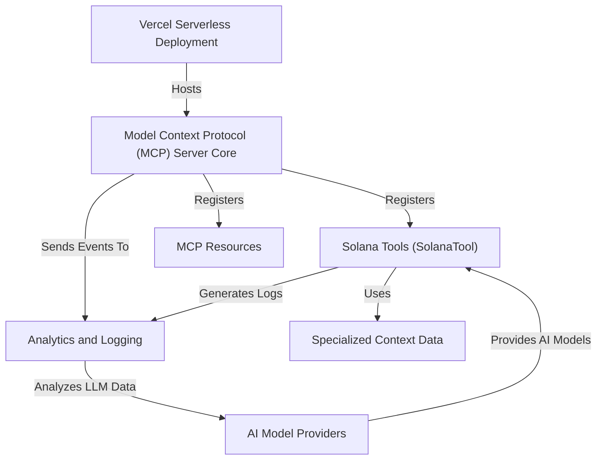

# Tutorial: solana-mcp-official

The `solana-mcp-official` project implements an **official Solana Developer Model Context
Protocol (MCP) server**, designed to offer *up-to-date Solana ecosystem information* and
*specialized AI assistance*. It acts as a central hub, orchestrating various **AI-powered
tools** and structured **data resources** to respond to developer queries. The server is
optimized for deployment as a *serverless function* on Vercel, ensuring scalability and
efficient operation, while robust analytics track its usage.

## Visual Overview

## Chapters

1. [Model Context Protocol (MCP) Server Core
](01_model_context_protocol__mcp__server_core_.md)
2. [Solana Tools (SolanaTool)
](02_solana_tools__solanatool__.md)
3. [AI Model Providers
](03_ai_model_providers_.md)
4. [Specialized Context Data
](04_specialized_context_data_.md)
5. [MCP Resources
](05_mcp_resources_.md)
6. [Analytics and Logging
](06_analytics_and_logging_.md)
7. [Vercel Serverless Deployment
](07_vercel_serverless_deployment_.md)